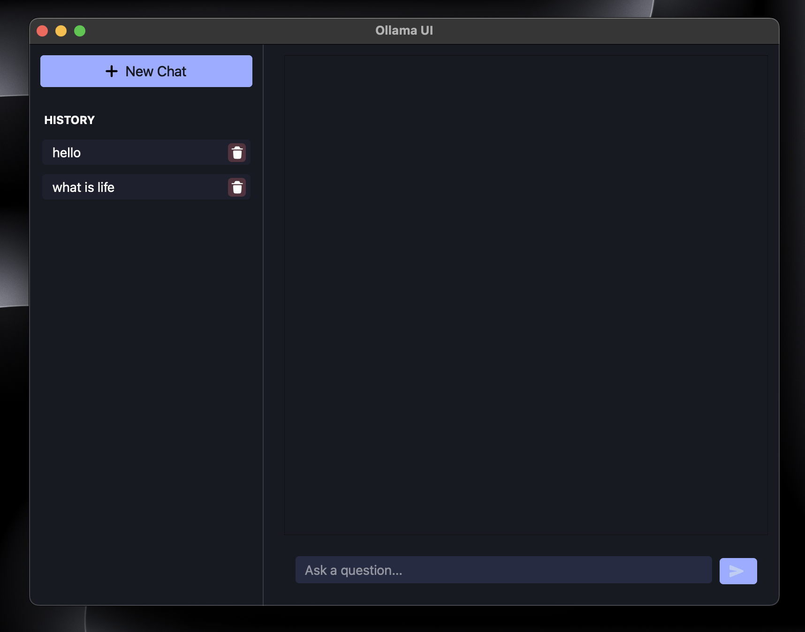
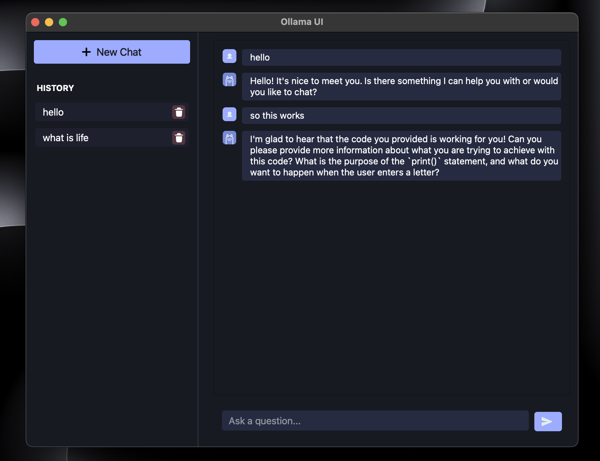

# Ollama UI App
Desktop app created to communicate with ollama model locally

Complete Project Documentation: [Ollama UI Documentation](https://tejasbhovad.notion.site/Ollama-UI-55d9e19b4b34405d9a20457ab10801c3?pvs=4)

# ⚙️ Tech Stack:

1. PySide6: https://doc.qt.io/qtforpython-6/
2. Qt Resource System: https://doc.qt.io/qt-5/resources.html
3. CSS for styling: https://developer.mozilla.org/en-US/docs/Web/CSS
4. PyInstaller for building the Apps: https://pyinstaller.org/en/stable/
5. Ollama Python API for communicating with AI models locally: https://ollama.com/ https://github.com/ollama/ollama-python
 
# 📦 Features:

1. Chat with Ollama locally
2. modern UI
3. Dark Mode

# 📸 Screenshots:



# 🚀 Getting Started:

## Installation

1. Clone the repository

2. Install the dependencies

3. Run the app (main.py)

4. Build the app using PyInstaller
    
```bash
pyinstaller --name="Ollama UI" --windowed --add-data "index.css:." --icon=icons/ai_icon.png main.py --onefile
```
5. The executable file will be created in the dist folder

## Contributing

1. Fork the repository

2. Create a new branch with the feature name

3. Make the changes

4. Push the changes to your branch

5. Create a pull request

6. Wait for the code review

7. Once the code is reviewed and approved, it will be merged

> Note: Please follow the coding standards and conventions and be patient for the code review


## Reference bundling SVGs in Qt
- https://doc.qt.io/qtforpython-6/tutorials/basictutorial/qrcfiles.html
- https://doc.qt.io/qt-5/resources.html